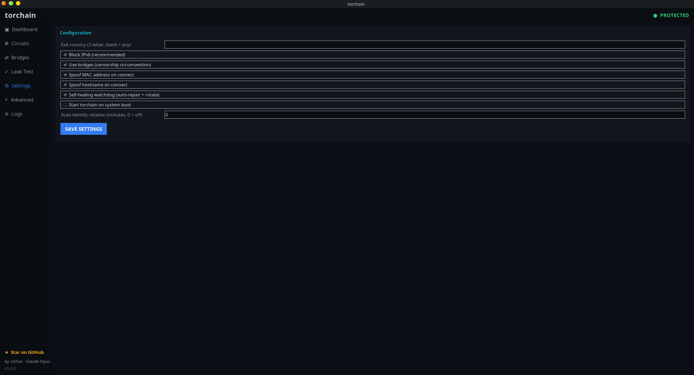

<div align="center">

# 🧅 Torchain

**Fast, system-wide Tor anonymizer with an enterprise-grade Kali-themed dashboard.**

*Route every packet through Tor. Verify there are no leaks. Look good doing it.*


[](https://github.com/ctx0an/Torchain/actions/workflows/build-apk.yml)
[](https://github.com/ctx0an/Torchain/actions/workflows/ci.yml)

</div>

---

## Why v5

v5 builds on the v4 rewrite and makes the whole experience **fully automatic**:

| Goal | How v5 delivers |
| --- | --- |
| ⚡ **Fast startup** | Thin bash launcher + lazy-imported Python package. No work happens until you ask for it. |
| 🪶 **Low memory** | Pure standard library. No background animation loops. The GUI idles at single-digit CPU and ~15 MB RAM. |
| 🚀 **Fast Tor connect** | Persistent guard state, `AvoidDiskWrites`, tuned circuit timeouts, and live bootstrap polling over the control port. |
| 🔑 **Fully automatic sudo** | Every privileged command — including the GUI — auto-elevates (supports `sudo`, `pkexec`, and Windows UAC). The GUI forwards `DISPLAY`/`XAUTHORITY` and grants the X cookie, so no more `Invalid MIT-MAGIC-COOKIE-1`. `/usr/bin/torchain` fallback symlink ensures `sudo torchain` works even when sudo's `secure_path` excludes `/usr/local/bin`. |
| 🐕 **Self-healing watchdog** | A robust daemon that repairs tor/firewall if they drop and enforces automatic identity rotation. |
| 🔌 **Run on boot** | One command (or checkbox) to start torchain at boot via systemd, with an rc.local/cron fallback. |
| 🌉 **Rich bridges** | obfs4 / snowflake / meek_lite / webtunnel plus add/remove/list, **fetch** from the Tor Project, and **test** reachability with TCP ping. |
| 🔁 **Migration manager** | Detects ANY older torchain install, removes it, and installs v5 in its place. |
| 🖥️ **VM + bare-metal** | Detects VMware/VirtualBox/KVM/Xen/Hyper-V/containers and adapts (e.g. MAC-spoof rollback under hypervisor port security). |
| 🛡️ **Robust error handling** | A typed exception hierarchy with human hints. Every failure rolls back **fail-closed** — you are never left half-protected. |
| 🎨 **Enterprise design** | A Kali-Linux-themed dashboard with a unique generated app icon, sidebar navigation, status pills, stat tiles, and scrollable tables. |

---

## Architecture

```
torchain            ← thin bash launcher (auto-elevates everything, incl. GUI X-forwarding)
tc4/                ← Core Python package (Linux desktop engine & dashboard)
├── engine.py       ← orchestrates tor + firewall + spoofing + watchdog (fail-closed)
├── gui.py          ← event-driven Tk dashboard (no busy loops)
└── ...             
tcwin/              ← Windows 11 parallel package (WinINET proxy + Firewall engine & GUI)
app/                ← Native Android application port (Jetpack Compose, Kotlin)
├── src/main/java   ← TorVpnService, TorController, and compose UI screens
└── src/main/res    ← UI assets, launcher icons, XML configurations
scripts/
└── download_tor.sh ← Helper script to fetch native libtor.so binaries
```

Each module/package does one thing. Everything is dependency-light and unit-testable.

---

## Install

```bash
git clone https://github.com/ctx0an/torchain.git
cd torchain
sudo ./setup.sh
```

The installer pulls dependencies (`tor`, `iptables`, `iproute2`, `python3`, `python3-tk`),
creates the dedicated `debian-tor` user, installs to `/usr/share/torchain`, and links
`torchain` into your `PATH`.

---

## Windows 11

Torchain ships a parallel Windows 11 build (the `tcwin` package) with the same
CLI and dashboard. Because Windows has no transparent proxy, it enforces Tor a
different way: it launches a dedicated `tor.exe`, points the system (WinINET)
proxy at Tor's SOCKS port, and flips **Windows Defender Firewall** to
block-all-outbound except `tor.exe` — a fail-closed kill-switch.

```
REM Double-click setup.bat, or from any terminal in the repo folder:
windows\setup.bat
```

**Zero package-manager dependencies.** No winget, no Chocolatey, no Scoop —
just direct downloads and the bundled files already in the repo:

1. **Python** is downloaded directly from python.org and installed quietly into
   `%ProgramData%\torchain\app\python` — a **full install with Tcl/Tk** so the
   GUI works out of the box. Nothing is added to the system PATH; the entire
   install is removable by deleting the folder.
2. **tor.exe** is extracted from the **bundled `Tor.zip`** already in
   `windows\Tor.zip` — no download needed. Includes `geoip` databases and
   pluggable transports (`lyrebird` for obfs4/meek bridges).

The installer self-elevates via UAC. It's a `.bat` file — no PowerShell
execution policy changes required.

```
torchain doctor        # check admin, tor.exe, firewall, tkinter
torchain start         # route system traffic through Tor (UAC elevates)
torchain status
torchain stop          # ALWAYS restores connectivity first
torchain gui           # dashboard (panic / pandora prompt for UAC)
```

### Built so it won't break Windows networking

Breaking the network stack on Windows is far more painful to undo than on
Linux, so the Windows build is deliberately conservative:

- **Always-restore-first teardown.** `stop`, `panic`, and `pandora` put the
  firewall policy back to *allow-outbound* and clear the proxy **before**
  anything else, so a mid-operation crash can never strand you offline.
- **Reversible kill-switch.** It only changes the firewall's default outbound
  policy and adds removable `torchain-*` rules. It never disables the Firewall
  service itself, and never touches routes or adapters.
- **Safe recovery by default.** `torchain repair` (the "fix internet" option,
  also a Dashboard button) restores the firewall, deletes torchain rules,
  clears the proxy, flushes DNS, and renews DHCP — all reversible, never
  destructive.
- **Opt-in deep reset.** The aggressive stack reset (`netsh winsock reset` /
  `netsh int ip reset`, which needs a reboot and can disturb other VPN/proxy
  software) only runs when you explicitly ask: `torchain repair --deep`.
- **Python-free safety net.** `windows\internet.bat` (and `internet.ps1`) restores connectivity
  even if Python or torchain itself is broken — it self-elevates and runs the
  same safe steps (add `/deep` for the stack reset).
- **Safe uninstallation.** `windows\uninstall.bat` (also copied to
  `%ProgramData%\torchain\app\uninstall.bat` during installation) stops all boot tasks
  and background processes, restores original network/DNS settings, cleans up system PATH
  and environment variables, deletes all shortcuts, and removes the Torchain files.

> Verification note: the Windows port is validated by syntax check and code
> review in this build, not a live Windows run.


---

## Android Build

Torchain includes a native Android port (`com.torchain.android`) that packs a Jetpack Compose frontend and runs a local Tor proxy service inside an Android VPN service framework (`TorVpnService`), ensuring a system-wide anonymized connection.

### Features
- **Local Tor Daemon Integration**: Embeds the native `libtor.so` binary (extracted automatically from Orbot release APKs).
- **Jetpack Compose UI**: Modern, clean theme with Sidebar navigation matching the desktop design.
- **Full protection**: VPN-mode routes all TCP packets through the local Tor daemon.
- **Bridges Screen**: Configure custom bridge lines (obfs4, snowflake, meek_lite, webtunnel), fetch new bridges from Tor Project Moat API, and test TCP-ping reachability.
- **Circuits Screen**: Live view of active Tor circuits with country flags and GeoIP lookup.
- **Logs Screen**: Real-time rotating logs from the Tor service daemon.

### Building Locally

To build the APK locally, make sure you have the Android SDK and JDK 17+ installed:

1. **Download Tor binaries and assets**:
   Runs a script to pull the universal Orbot release APK and extract `libtor.so` libraries for all supported ABIs (`arm64-v8a`, `armeabi-v7a`, `x86`, `x86_64`) plus geoip databases:
   ```bash
   bash scripts/download_tor.sh
   ```
2. **Build the Debug APK**:
   ```bash
   ./gradlew assembleDebug
   ```
   The build outputs to `app/build/outputs/apk/debug/app-debug.apk`.

### GitHub Actions CI
The repository includes a [GitHub Actions workflow](.github/workflows/build-apk.yml) that automatically builds the Android application and uploads the debug APK as a workflow artifact upon every push to the `main` branch.


---

## Usage

```bash
torchain doctor        # pre-flight system check
sudo torchain start    # route ALL traffic through Tor (live bootstrap bar)
torchain status        # show current protection state
sudo torchain rotate   # request a brand-new Tor identity
torchain leaktest      # verify nothing escapes Tor
sudo torchain stop     # restore normal networking
torchain gui           # launch the Kali-themed dashboard
```

### Emergency kill switch

```bash
sudo torchain panic          # drop ALL non-loopback traffic instantly
sudo torchain panic disarm   # restore
```

### Bridges (censorship circumvention)

```bash
torchain bridge type obfs4                 # obfs4|snowflake|meek_lite|webtunnel|custom
torchain bridge add 'obfs4 1.2.3.4:443 <FP> cert=... iat-mode=0'
torchain bridge list
torchain bridge remove 0                   # by index (or paste the exact line)
torchain bridge enable
torchain bridge fetch                      # fetch fresh bridges from Tor Project
torchain bridge fetch --transport webtunnel
torchain bridge test                       # TCP-ping each bridge to check reachability
torchain bridge test --timeout 10
```

### Watchdog, boot & migration

```bash
torchain watchdog start      # self-healing daemon (auto-repair + rotate)
torchain watchdog status
torchain boot enable         # start torchain automatically at boot
torchain migrate --scan      # show any older torchain installs that would be removed
torchain migrate             # remove older installs and put v5 in their place
```

### Configuration

```bash
torchain config                          # list all settings
torchain config --set exit_country=us    # pin exit nodes to a country
torchain config --set block_ipv6=true
torchain config --set spoof_mac=true
torchain config --set watchdog_enabled=true
torchain config --set auto_rotate_minutes=10
torchain config --set start_on_boot=true
```

---

## The dashboard

Launch with `torchain gui`. The window title is simply **torchain**.

The window uses a unique, procedurally-generated icon (an "onion + chain link" mark in the
Kali palette) — generated in pure Python, so no binary assets ship in the repo.

The entire UI is **event-driven** — no animation timers, no polling storms. It only
redraws a widget when the underlying value actually changes.

### Dashboard

One-click connect/disconnect, live bootstrap progress, PID / firewall / bootstrap tiles.


### Bridges

Pick a transport, add/remove/clear custom bridge lines, **fetch** 11 builtin bridges from the Tor Project via the Moat API, and **test** each bridge line with a TCP ping to confirm reachability.


### Settings

Exit country, IPv6 blocking, bridges, MAC/hostname spoofing, watchdog, boot, auto-rotation.



### Logs

Live, scrollable tail of the rotating log file.


### Leak Test

Run the full or quick suite, color-coded pass/fail — verify your real IP, DNS, and IPv6 never escape Tor.


The dashboard sidebar gives you:

- **Dashboard** — one-click connect/disconnect, live bootstrap progress, PID / firewall / bootstrap tiles.
- **Circuits** — live Tor circuit table with IP, nickname, and GeoIP country for each hop.
- **Bridges** — pick a transport, add/remove/clear custom bridge lines, fetch from Tor Project, and test reachability.
- **Leak Test** — run the full or quick suite, color-coded pass/fail.
- **Settings** — exit country, IPv6 blocking, bridges, MAC/hostname spoofing, watchdog, boot, auto-rotation.
- **Advanced** — enable boot, start/stop the watchdog, scan for old versions; shows your VM/bare-metal environment.
- **Logs** — live, scrollable tail of the rotating log file.

---

## Security model

- **Fail-closed**: if any start step fails, firewall rules and tor are rolled back so
  you are never left partially exposed.
- **No leaks by default**: IPv6 egress is blocked, DNS is forced through Tor's `DNSPort`,
  and all non-Tor TCP is dropped.
- **Reversible**: spoofing saves original values and restores them on `stop`.

See [`SECURITY.md`](SECURITY.md) for the disclosure policy.

⚠️ torchain protects the network layer only. Read [`LIMITATION.md`](LIMITATION.md) for the full threat model and limitations.
---

## Contributing

Issues and PRs welcome — see [`CONTRIBUTING.md`](CONTRIBUTING.md) and the
[`CODE_OF_CONDUCT.md`](CODE_OF_CONDUCT.md). CI runs ShellCheck, `bash -n`, and Python
byte-compilation on every push.

## Credits

Created by **ctx0an**, built with **Claude Opus 4.8**.

If torchain is useful to you, please ⭐ [**star it on GitHub**](https://github.com/ctx0an/torchain) — there's also a one-click **★ Star on GitHub** button in the app's sidebar.

## License

MIT — see [`LICENSE`](LICENSE).

> **Disclaimer:** torchain is a tool for privacy and security research. No tool makes
> you perfectly anonymous. Understand your threat model and use responsibly and legally.
